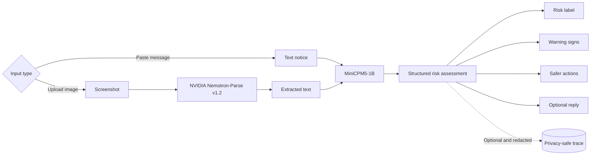

<div align="center">


# NoticeCheck

**Review suspicious Pakistani messages and screenshots before you click, pay, or reply.**

[](https://huggingface.co/spaces/build-small-hackathon/noticecheck)
[](#run-locally)
[](#requirements)
[](https://www.python.org/)
[](LICENSE)

[**Try the live demo**](https://huggingface.co/spaces/build-small-hackathon/noticecheck)
·
[**Read the field notes**](docs/field-notes.md)
·
[**View the trace dataset**](https://huggingface.co/datasets/build-small-hackathon/pakistan-notice-helper-traces)

</div>


NoticeCheck is the fully local version of my earlier
[Pakistan Notice Helper](https://huggingface.co/spaces/build-small-hackathon/pakistan-notice-helper),
created for the Hugging Face Hackathon. It helps people review suspicious
Pakistani messages and screenshots before acting on them.

The app handles SMS messages, bank alerts, bills, courier notices, challans,
emails, and screenshots. Each assessment includes:

- a clear risk label
- an evidence-based explanation
- detected warning signs and pressure tactics
- safer next steps
- an optional reply draft

The hosted demo uses Hugging Face ZeroGPU. The same Transformers pipeline runs
privately on a local NVIDIA GPU through Docker Compose.

## How It Works



| Component | Technology |
| --- | --- |
| Reasoning model | `openbmb/MiniCPM5-1B` |
| Screenshot OCR | `nvidia/NVIDIA-Nemotron-Parse-v1.2` |
| Inference | PyTorch and Transformers |
| Hosted compute | Hugging Face ZeroGPU |
| Local compute | NVIDIA CUDA through Docker Compose |
| Interface | Custom Gradio, HTML, CSS, and JavaScript |

## Run Locally

> [!IMPORTANT]
> Local inference requires Docker Compose 2.30 or newer, a supported NVIDIA GPU
> with a current driver, NVIDIA Container Toolkit on Linux, and enough disk
> space and VRAM for both models.

Clone the repository, download its Git LFS assets, and confirm that NVIDIA
Container Toolkit exposes the GPU inside Docker:

```bash
git clone https://github.com/kingabzpro/local-notice-check.git
cd local-notice-check

git lfs install
git lfs pull

docker run --rm --gpus all \
  pytorch/pytorch:2.9.1-cuda12.8-cudnn9-runtime \
  python -c "import torch; print(torch.cuda.is_available(), torch.cuda.get_device_name(0))"

docker compose up --build
```

The GPU check must report `True` and print the NVIDIA GPU name.

Open <http://localhost:7860>.

The first run downloads both models. Docker stores them in a persistent volume,
so later starts can reuse them.

<details>
<summary><strong>Optional environment variables</strong></summary>

Create a `.env` file beside `compose.yaml` to override the defaults:

```dotenv
NOTICECHECK_PORT=7860
TRANSFORMERS_MODEL_REPO=openbmb/MiniCPM5-1B
MODEL_ENABLE_THINKING=0
HF_TOKEN=
```

</details>

<details>
<summary><strong>Stop or completely remove the local stack</strong></summary>

Stop the containers:

```bash
docker compose down
```

Remove the containers and downloaded model volumes:

```bash
docker compose down --volumes
```

</details>

## Privacy and Safety

Local Docker inference keeps notices and screenshots away from remote model
APIs. Optional trace publishing excludes raw text, screenshots, OCR text,
links, identifiers, and full model responses. See the
[trace dataset card](traces/dataset_card.md) for the schema and privacy rules.

> [!TIP]
> Leave `HF_TOKEN` empty to run locally without publishing privacy-safe traces
> to Hugging Face.

> [!WARNING]
> NoticeCheck provides decision support, not proof that a sender is genuine.
> Never share OTPs, PINs, passwords, CVVs, CNIC numbers, or card details.
> Verify suspicious messages through an official website, app, statement,
> card, or independently located helpline.

The interface and generated assessments are currently English-only. OCR may
detect other languages, but the app does not generate Urdu assessments.

## Learn More

- [Live Hugging Face Space](https://huggingface.co/spaces/build-small-hackathon/noticecheck)
- [Privacy-safe trace dataset](https://huggingface.co/datasets/build-small-hackathon/pakistan-notice-helper-traces)
- [Field notes: making NoticeCheck fully local](docs/field-notes.md)
- [LinkedIn project post](https://www.linkedin.com/posts/1abidaliawan_huggingfacehackathon-huggingface-ai-ugcPost-7471594790506192896--_53/)
- [MIT License](LICENSE)
